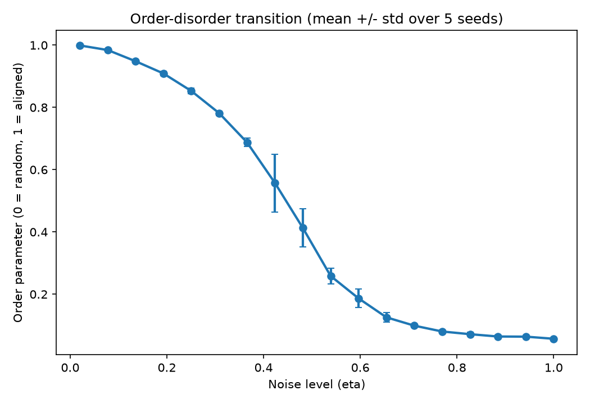
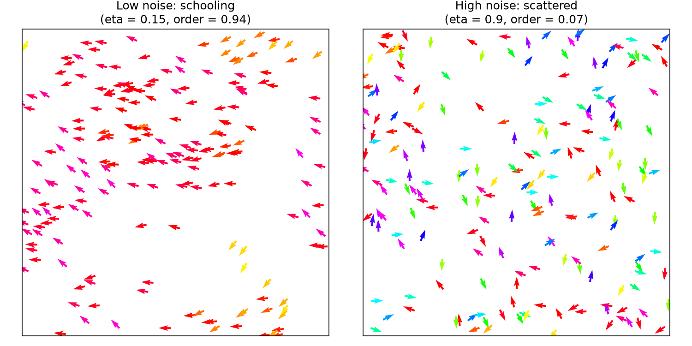

# Agent-Based Model of Fish Schooling (Vicsek Model)

## What this is
A from-scratch implementation of the Vicsek model (Vicsek et al., 1995),
the classic minimal model of collective motion, applied here as a model
of fish schooling. No external data is used. The project tests whether a
simple local alignment rule is enough to produce large-scale schooling,
and how that depends on noise.

## Model
- N = 200 agents move at constant speed v0 = 0.5 in a periodic 2D box of
  side L = 10
- At each timestep every agent adopts the circular mean heading of all
  neighbors within radius 1.0 (including itself), then adds uniform
  random noise scaled by eta
- Order parameter: length of the summed heading vectors divided by N
  (0 = random headings, 1 = perfectly aligned)

## Key result
Sweeping noise from eta = 0.02 to 1.0, averaged over 5 random seeds,
shows a clear order-disorder transition. The order parameter is **0.999**
at the lowest noise tested (schooled) and falls to **0.063** at the
highest noise tested (scattered), with the steepest drop between roughly
**eta = 0.36 and eta = 0.60**.





The floor of about 0.06 at high noise is expected, not an error: for N
random unit vectors, the normalized sum has expected length
approximately 1/sqrt(N), which is about 0.07 for N = 200. A fully
disordered group therefore never reads exactly zero. Error bars (shown
in the phase-transition plot) are small at both extremes and widest
around the transition itself (eta ~ 0.42-0.48), which is expected: this
is the region where the outcome is most sensitive to the random initial
configuration.

## How to run
```
pip install -r requirements.txt
python analysis.ipynb
```
This regenerates both figures and `phase_transition_results.csv`.

## Limitations
- Averaged over 5 seeds; a formal study would use more, and would study
  how the transition sharpens as N grows.
- The transition point and its sharpness depend on N, box size, and
  interaction radius; this scaling was not studied here.
- The model is a minimal abstraction: constant speed, 2D, no
  attraction/repulsion, no predators. It has not been compared against
  empirical schooling data.

## What I'd do next
- Study how the transition changes with N
- Add attraction and repulsion rules (Couzin-style zones)
- Compare simulated order curves with published data on real schooling
  species
- Extend to 3D

## Reference
Vicsek, T., Czirok, A., Ben-Jacob, E., Cohen, I., & Shochet, O. (1995).
Novel type of phase transition in a system of self-driven particles.
Physical Review Letters, 75(6), 1226-1229.
